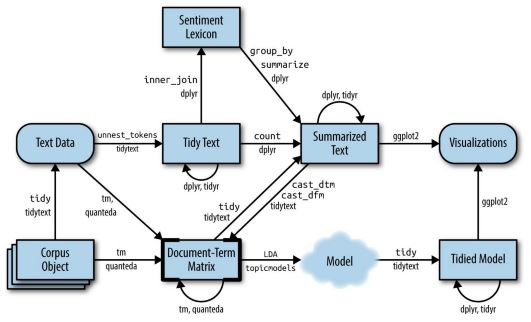

<style type="text/css">
.table {

    width: 100%;

}
</style>

```{r setup, include=FALSE}
knitr::opts_chunk$set(echo = TRUE)
```

# Challenge
Developing a classification algorithm for wikipedia comments to detect if they are toxic, severe toxic, obscene, threat, insult and/or identity hate. The data set is part of a Kaggle competition. Learnings and inspiration and taken from <https://www.tidytextmining.com>.

## Text workflow in R


# Initialization project
## Packages
```{r initialization, results='hide', message=FALSE, warning=FALSE}
library(dplyr)
library(stringr)
library(tm)
library(tidytext)
library(ggplot2)
library(SnowballC)
library(knitr)
library(kableExtra)
library(igraph)
library(qdap)
library(topicmodels)
library(tidyr)
library(quanteda)
```


## Loading data
```{r loading data}
df_train <- read.csv("data/train.csv", sep = ",", stringsAsFactors = F, nrows = 6000)
df_test <-  read.csv("data/test.csv", sep = ",", stringsAsFactors = F, nrows = 6000)

```
# Data understanding
## Size and dimensions
Here is the key figures for the train and test data sets:

Table Name  | # rows            |  Column Names
------------- | -----------           | ----------------------------------------------------------------------------------------------
df_train    | `r nrow(df_train)`| `r colnames(df_train)` 
df_test     | `r nrow(df_test)` | `r colnames(df_test)`


## Example text

```{r, echo = FALSE }
df_train$comment_text_n <- str_replace_all(df_train$comment_text, "[\r\n]", " ") 
```


Text classification  | Example text
-------------------|---------------------------------------------------------------
Non-Toxic           | `r df_train$comment_text_n[1]`
toxic               | `r df_train$comment_text_n[which(df_train$toxic==1)[2]]`
severe_toxic        | `r df_train$comment_text_n[which(df_train$severe_toxic==1)[1]]`
obscene             | `r df_train$comment_text_n[which(df_train$obscene_toxic==1)[1]]`
threat              |  `r df_train$comment_text_n[which(df_train$threat==1)[1]]`
insult              |  `r df_train$comment_text_n[which(df_train$insult==1)[2]]`
identity_hate       |  `r df_train$comment_text_n[which(df_train$identity_hate==1)[1]]`


## Classification classes
In the data set we have the following observations per toxic class (some of the text might be part of multiple toxic classes):
```{r, echo=FALSE}
df_train$rowSum <- rowSums(df_train[,3:8])
df_train$nontoxic <- ifelse(df_train$rowSum==0,1, 0)
```
Text class     | Non-Toxic | toxic | severe_toxic | obscene | threat | insult | identity_hate     
-------------- | -----------|-----------|-----------|-----------|-----------|-----------|----------- 
Observations   |`r sum(df_train$nontoxic)`| `r sum(df_train$toxic)`| `r sum(df_train$severe_toxic)`| `r sum(df_train$obscene)`| `r sum(df_train$threat)`| `r sum(df_train$insult)`| `r sum(df_train$identity_hate)`

## Network representation of the dependent classes
In this section we develop a way of visualizing the strength of the depenendies between the classes.
First we create a summary table per class.

```{r network}
termCommentMatrix <- df_train %>%
  select(-comment_text, -comment_text_n, -rowSum, -id) %>%
  as.matrix() %>%
  t()

termMatrix <- termCommentMatrix[1:6,]%*%t(termCommentMatrix[1:6,])

g <- graph.adjacency(termMatrix, weighted=T)
# remove loops
g <- simplify(g)
# set labels and degrees of vertices
V(g)$label <- V(g)$name
V(g)$degree <- degree(g)
layout1 <- layout.fruchterman.reingold(g)
plot(g, layout=layout1, edge.width = edge.betweenness(g))

```

## Word frequency by class

```{r, warning=FALSE, message=FALSE}
toxic_stop_words <- data.frame(word = c("article", "wikipedia", "edit", "page", "å"), lexicon = "Manual")


toxic_tokens <- df_train %>%
  unnest_tokens(output = word, input = comment_text) %>%
  filter(!str_detect(word, "^[0-9]*$")) %>%
  anti_join(stop_words) %>% 
  anti_join(toxic_stop_words) %>%
  mutate(word = SnowballC::wordStem(word)) %>%
  select(-comment_text_n, -rowSum)

head(toxic_tokens)


toxic_tfidf <- toxic_tokens %>%
  count(nontoxic, word) %>%
  bind_tf_idf(term = word, document= nontoxic, n = n)

plot_toxic <- toxic_tfidf %>%
  arrange(desc(tf_idf)) %>%
  mutate(word = factor(word, levels = rev(unique(word))))

plot_toxic %>%
  mutate(nontoxic = factor(nontoxic)) %>%
  group_by(nontoxic) %>%
  top_n(10) %>%
  ungroup() %>%
  ggplot(aes(word,tf_idf)) + geom_col() + labs(x = NULL, y = "tf_idf") +
  facet_wrap(~nontoxic, scales = "free") + coord_flip()
  


```


# Data preparation
In this first approach we aim at classifying whether the text is non-toxic or not (meaning all the toxic categories).


## From tidy to term matrixs
```{r}

toxic_dfm_tidytext <- toxic_tokens %>%
  count(id,word) %>%
  #cast_dtm(document = id, term = word, value = n, weighting = tm::weightTfIdf)
  cast_dfm(document = id, term = word, value = n) #%>%
  #removeSparseTerms(sparse = 0.99)

toxic_dtm_tidytext <- toxic_tokens %>%
  count(id,word) %>%
  #cast_dtm(document = id, term = word, value = n, weighting = tm::weightTfIdf)
  cast_dtm(document = id, term = word, value = n) #%>%
  #removeSparseTerms(sparse = 0.99)


```


# Modeling

## Unsupervised learning
With the DocumentTermMatrix as a starting point
```{r}
# Removing empty rows
rowTotals <- apply(toxic_dtm_tidytext, 1, sum)
toxic_dtm_tidytext_new <- toxic_dtm_tidytext[rowTotals>0,]

toxic_lda <- LDA(toxic_dtm_tidytext_new, k = 2, control = list(seed = 12))

toxic_topics <- tidy(toxic_lda, matrix="beta")

toxic_lda_top_terms <- toxic_topics %>%
  group_by(topic) %>%
  top_n(10,beta) %>%
  ungroup()%>%
  arrange(topic, -beta)

toxic_lda_top_terms %>%
  mutate(term = reorder(term,beta)) %>%
  ggplot(aes(term, beta, fill = factor(topic))) +
  geom_col(show.legend = FALSE) + 
  facet_wrap(~topic, scales = "free") + coord_flip()

beta_spread <- toxic_topics %>%
  mutate(topic = paste0("topic", topic)) %>%
  spread(topic, beta) %>%
  filter(topic1 >0.001 | topic2 > 0.001) %>%
  mutate(log_ratio = log2(topic2/topic1)) %>%
  arrange(desc(log_ratio))

beta_spread

```


## Supervised learning

### Naive Bayes model
First step is to split current labeled data set into a training and test data set. Assuming a 80 % training set size.
```{r}
split_threshold <- floor(0.8*nrow(toxic_dfm_tidytext))

toxic_dfm_train <- toxic_dfm_tidytext[1:split_threshold,]
toxic_dfm_test <- toxic_dfm_tidytext[(split_threshold+1):nrow(toxic_dfm_tidytext), ]
toxic_dfm_test <- dfm_select(toxic_dfm_test, toxic_dfm_train)

tmp <- toxic_tokens %>%
  select(id) %>%
  distinct()

label <- df_train %>%
  inner_join(tmp) %>%
  select(id,nontoxic)

train_label <- label[1:split_threshold,]
test_label <- label[(split_threshold+1):nrow(toxic_dfm_tidytext),]

```

With our data split into training and test data sets, we'll train our naive Bayes model, and tell the model to pay attention to the content of the text message and the ham or spam label of the message. Then, we'll use that trained model to predict whether the new test observations are ham or spam all on its own. Finally, we'll make a contingency table to see how accurately it performs.

```{r}

toxic_classifier <- textmodel_nb(toxic_dfm_train, train_label$nontoxic)

```


# Evaluation

```{r}
toxic_predictions <- predict(toxic_classifier, newdata = toxic_dfm_test)
table(toxic_predictions$nb.predicted, test_label$nontoxic)
```

